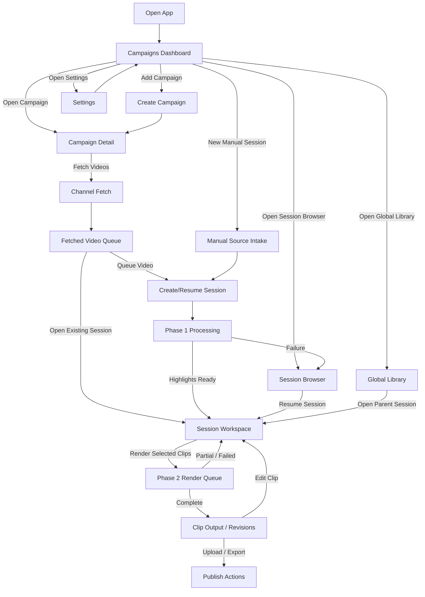

# Full Workflow Application

## Purpose

This file describes the application flow from the moment the user opens the app until the final clip is exported or uploaded.

It combines:
- user journey
- navigation logic
- button-visibility logic
- back-navigation rules
- session continuation logic

This is the closest document to a true application logic map.

---

## 1. Mermaid flow



---

## 2. Top-level application flow in ASCII

```text
+---------------------+
| Open App            |
+----------+----------+
           |
           v
+---------------------+
| Campaigns Dashboard |
+----------+----------+
           |
           +--> Add Campaign
           |
           +--> Open Campaign
           |
           +--> New Manual Session
           |
           +--> Session Browser
           |
           +--> Global Library
           |
           +--> Settings
```

---

## 3. Campaigns Dashboard logic

## Visible buttons
- `Add Campaign`
- `Open Campaign`
- `Rename Campaign`
- `Archive Campaign`
- `New Manual Session`
- `Session Browser`
- `Global Library`
- `Settings`

## Logic

### If no campaigns exist
- `Open Campaign` hidden or disabled
- `Rename Campaign` hidden or disabled
- `Archive Campaign` hidden or disabled
- `New Manual Session` still visible

### If a campaign row is selected
- `Open Campaign` visible
- `Rename Campaign` visible
- `Archive Campaign` visible

## Back behavior
- dashboard is the root page
- back from dashboard should not go to another working page

---

## 4. Campaign Detail logic

```text
Campaign Detail
  -> Fetch Videos
  -> Video Queue
  -> Failed/Partial Summary
  -> Resume Existing Session
```

## Visible buttons
- `Fetch Videos`
- `Queue All New`
- `Process Selected`
- `Retry Failed`
- `Open Session`
- `Back to Campaigns`

## Logic

### If channel URL missing
- `Fetch Videos` disabled

### If no fetched videos
- `Queue All New` disabled
- `Process Selected` disabled

### If a selected video has a linked session
- `Open Session` enabled

### If failed queue items exist
- `Retry Failed` enabled

## Back behavior
- back goes to `Campaigns Dashboard`

---

## 5. Manual Source Intake logic

This is the compatibility flow for local files and one-off jobs.

## Visible inputs
- source type selector
  - local file
  - single YouTube URL
- clip count
- subtitle mode

## Buttons
- `Find Highlights`
- `Back to Campaigns`

## Logic

### If local file missing
- `Find Highlights` disabled

### If YouTube URL invalid
- `Find Highlights` disabled

## Back behavior
- back goes to `Campaigns Dashboard`

---

## 6. Phase 1 Processing logic

## Purpose
- fetch/download source
- subtitle/transcription
- highlight finding

## Buttons
- `Cancel`
- `Back` only after a final success/failure state if safe

## Logic
- no edit controls here
- only stage/progress display
- success writes session manifest and opens `Session Workspace`
- failure writes last error and exposes resume/retry later through session browser

## Back behavior
- if actively processing: back disabled
- if failed: back goes to `Session Browser` or `Campaign Detail` depending on context

---

## 7. Session Workspace logic

```text
Session Workspace
  -> Source Summary
  -> Highlight List
  -> Highlight Editor
  -> Hook/Caption/Tracking/Overlay Controls
  -> Render Queue
  -> Output/Revisions
```

## Buttons always potentially present
- `Save Draft`
- `Render Selected Clips`
- `Render Current Clip`
- `Retry Failed Clips`
- `Open Output`
- `Back to Campaign` or `Back to Session Browser`

## Logic

### When no highlight is selected
- editor panel shows empty state
- `Render Current Clip` disabled

### When one or more highlights are selected
- `Render Selected Clips` enabled

### When there are unsaved changes
- `Save Draft` enabled
- clip/highlight row shows dirty indicator

### When clip jobs are failed
- `Retry Failed Clips` enabled

### When clip output exists
- `Open Output` enabled

### When a clip is dirty
- primary action becomes `Render Changes`

## Back behavior
- if opened from a campaign: back goes to `Campaign Detail`
- if opened from session browser/global library: back returns to origin page
- if active render queue is running: back disabled or confirmation dialog shown

---

## 8. Phase 2 Render Queue logic

## Purpose
- show clip-by-clip rendering
- isolate failures per clip

## Buttons
- `Cancel Current Batch`
- `Back` disabled while render active

## Logic

### If clip 1 fails
- clip 1 status = `failed`
- queue continues to clip 2 if policy is continue-on-failure

### If some clips succeed and some fail
- session status = `partial`
- return to `Session Workspace`
- show completed clips + retry failed clips action

### If all succeed
- session status = `completed`
- open Output/Revisions tab in session workspace or results view

## Back behavior
- back disabled while actively rendering
- after completion/failure, back returns to `Session Workspace`

---

## 9. Output / Revisions logic

## Purpose
- inspect final clips
- upload/export
- re-edit later

## Buttons
- `Play`
- `Open Folder`
- `Upload`
- `Re-edit`
- `Open Parent Session`

## Logic

### If `master.mp4` missing
- `Play` disabled
- `Upload` disabled

### If clip is dirty but old revision exists
- `Play` allowed for current revision
- `Render Changes` shown prominently in Session Workspace

## Back behavior
- back goes to `Session Workspace`

---

## 10. Session Browser logic

## Purpose
- resume work that is not cleanly finished

## Buttons
- `Resume Editing`
- `Retry Rendering`
- `Open Output`
- `Archive Session`
- `Back to Campaigns`

## Logic

### If session stage in `highlights_found`, `editing`, `partial`, `failed`
- `Resume Editing` enabled

### If session has failed clip jobs
- `Retry Rendering` enabled

### If session output exists
- `Open Output` enabled

## Back behavior
- back goes to `Campaigns Dashboard`

---

## 11. Global Library logic

## Purpose
- browse everything completed across campaigns/sessions

## Buttons
- `Play`
- `Open Folder`
- `Open Parent Session`
- `Upload`
- `Back to Campaigns`

## Logic

### If clip metadata valid and `master.mp4` exists
- `Play` enabled
- `Upload` enabled

### If parent session manifest exists
- `Open Parent Session` enabled

## Back behavior
- back goes to `Campaigns Dashboard`

---

## 12. Settings logic

## Purpose
- configure provider modes, overlays, output defaults, and campaign defaults

## Buttons
- `Save`
- `Validate`
- `Back to Campaigns`

## Logic

### If provider mode = OpenAI API
- show OpenAI-appropriate task controls

### If provider mode = Groq Rotate
- show Groq pool health summary
- show task model selectors
- show Groq TTS voices for Hook Maker

### If settings are changed but not saved
- `Save` enabled
- leaving page should warn or auto-persist based on UX decision

## Back behavior
- back goes to the page that opened settings, defaulting to `Campaigns Dashboard`

---

## 13. No-dead-button logic summary

```text
If state missing -> action disabled
If state invalid -> action disabled + helper message shown
If state partial -> retry/resume action shown
If state dirty -> render-changes action shown
If artifact exists -> play/open/upload actions enabled
```

This must be derived from persisted state, not inferred from what the page last looked like.

---

## 14. Final logic summary

The intended app feeling is:

```text
Open app
  -> choose campaign or manual session
  -> fetch/queue/select source video
  -> create or resume session
  -> inspect and edit highlights
  -> render clips
  -> review/revise/upload clips
  -> come back later and continue exactly where you left off
```

That is the final workflow target for the major update.
